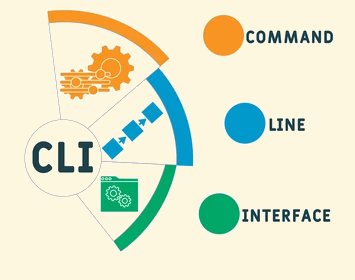

# O que é CLI?

---

---

  <h1>Tipos de CLI
</h1>

---
# 
Tipos de CLI

#### Existem vários tipos de interfaces de linha de comando. Os dois mais populares são **DOS** *(Disk Operating Systems)* para Windows e o **Shell Bash** para Linux e MacOS.

#### Cada CLI usa sua própria sintaxe de comando, mas todas funcionam de maneira semelhante. Inclusive, alguns comandos são idênticos entre o **DOS** e o **Shell Bash**.
---
# 
Tipos de CLI

#### Abaixo estão alguns exemplos de prompts de comando para diferentes interfaces de linha de comando, com a pasta raiz (root) como o diretório atual.

- Windows (DOS): **C: >**
- OS X (bash shell): : my-mac: / me $
- Linux (bash shell): [root @ myserver /] #

---
# Para que serve uma CLI?

#### Uma Interface de Linha de Comando pode ter vários benefícios dependendo do profissional que a utiliza. Para começar vamos avaliar os usos e vantagens da CLI para administradores de sistemas e desenvolvedores de software.

---
# Do ponto de vista dos administradores de sistemas
#### A maioria das pessoas prefere uma interface de usuário gráfica a uma de linha de comando. No entanto, algumas operações podem ser concluídas mais rapidamente usando um teclado em vez de um mouse. 

#### Portanto, as CLIs são frequentemente usadas por administradores de sistemas para tarefas comuns.

---
# Do ponto de vista dos administradores de sistemas
##### Outro uso importante é que uma configuração pode ser alterada remotamente apenas executando alguns comandos no computador. Em outras palavras, sem a necessidade de estar fisicamente presente no mesmo local desse computador e fazer essa tarefa manualmente.

##### O uso da CLI reduz muito tempo e esforços dos administradores de sistema. Além disso, também garante que o risco de segurança possa ser rastreado e evitado mesmo em grandes estruturas organizacionais (e com o mínimo de trabalho humano!).
---
# Do ponto de vista dos desenvolvedores
#### Os desenvolvedores também usam ferramentas CLI para seu trabalho diário de forma frequente.

#### Sabemos que um programador trabalha com muitos aplicativos ao mesmo tempo. Por isso, a  maneira ideal para **ele abrir um aplicativo ou caminho em seu(s) computador(es)** é por meio de linhas de comando na CLI.
---
# Do ponto de vista dos desenvolvedores
##### Outro uso importante para programadores é ao **escrever o código do aplicativo que estão desenvolvendo.** Na maioria das vezes, os programadores são obrigados a **adicionar referências a certas bibliotecas de terceiros** ao seu aplicativo para interagir com o mundo externo, que pode incluir uma impressora conectada ao mesmo computador, um banco de dados onde os dados do aplicativo são armazenados ou até mesmo um servidor de arquivos que está localizado em qualquer lugar do mundo e possui alguns arquivos que são usados ​​pelo aplicativo.

---
# Conclusão
###### Embora a interface do usuário em sistemas operacionais tenha percorrido um longo caminho de CLI para GUI, é necessário ver que a CLI ainda encontra muito uso e aplicações, principalmente na área de TI.

###### Uma CLI pode economizar parte do seu tempo se você estiver fazendo alguma tarefa repetida com a GUI.

###### No geral, uma CLI exige que você se lembre de alguns comandos e pode ser um pouco confusa no início.

###### Mas se você for paciente e interessado o suficiente, este tipo de ferramenta ainda pode fazer maravilhas e ajudá-lo a economizar um tempo precioso. Além de fornecer alta confiabilidade para executar algumas tarefas críticas.

