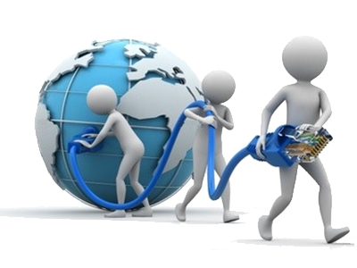
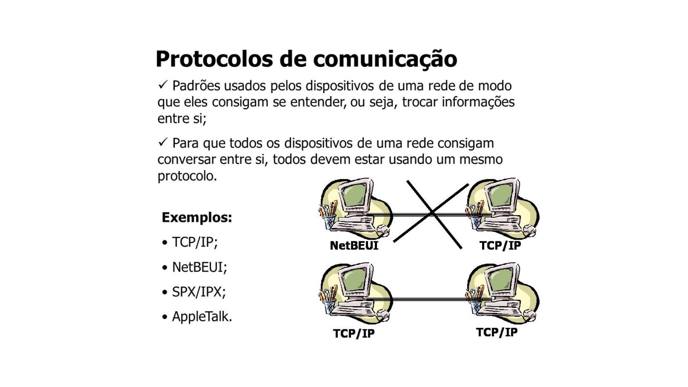
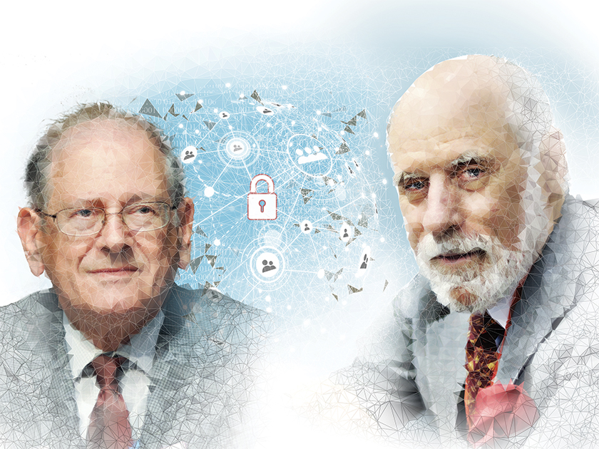
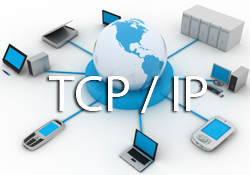

<!-- -------------- Slide 1: Introdução ao TCP/IP - comunicando-se em redes -------------- -->
<!-- _paginate: false
backgroundImage:  Url(https://ip-check.info/wp-content/uploads/2022/04/tcpip-696x453.jpg.webp) -->

<!--  Fala: Olá pessoal, me chamo Janaína e vou apresentar uma introdução aos famosos Protocolo de Controle de Transmissão e Protocolo de Internet: TCP e IP.

Imagine uma sala cheia de pessoas conversando, cada uma com sua própria linguagem e forma de se comunicar. Agora, pense em como seria difícil para elas se entenderem e trocarem informações de maneira eficiente. É nesse momento que entra em cena o protocolo de comunicação.-->

---
<!-- --------------------------------- Slide 2: protocolo de comunicação -------------------------------- -->
<!-- backgroundImage: "linear-gradient(to bottom, #c5cdd9, #35495e)"-->

# <!--fit-->O que é protocolo de comunicação?

<!--É como se fosse uma linguagem comum que todas as pessoas dessa sala deveriam falar para garantir que a informação seja transmitida corretamente. -->

## <!--fit--> Conjunto de *regras* e *convenções*

# <!--fit--> estabelecidas para permitir a *troca de dados entre:*

## <!--fit--> sistemas, dispositivos ou componentes de uma rede.

---
<!-- -------------------- Slide 3: imagem sobre protocolo de comunicação -------------------- -->
<!-- backgroundImage:  Url(Banner_site.webp) -->

---
<!-- ----------------------------------- Slide 4: aspectos do protocolo ----------------------------------- -->
<!-- backgroundImage: "linear-gradient(to bottom, #c5cdd9, #35495e)" 
_color: black -->

<!--Ele garante que a informação seja transmitida de maneira confiável, segura e padronizada.-->

## <!--fit--> Esse protocolo define aspectos como:

* ## A estrutura dos dados

* ##  Os formatos de mensagem

* ##  Os procedimentos de envio e recebimento

* ##  Os mecanismos de detecção e correção de erros. 

---
<!-- --------------------------------- Slide 5: aspectos do protocolo --------------------------------- -->
<!-- _color: dark
_class: lead -->

<!--Ele é como um mediador que facilita a troca de informações, tornando possível a interconexão de computadores, servidores, dispositivos móveis e muito mais.Com ele podemos enviar e receber e-mails, acessar sites, fazer chamadas de vídeo, compartilhar arquivos e desfrutar de uma infinidade de serviços online. -->
<!--Sem protocolos de comunicação padronizados, seria difícil, por exemplo, existir uma rede global como a Internet.-->

# <!--fit-->Porque o protocolo de comunicação é **essencial**

## <!--fit--> para a transmissão de dados em redes?

 

 Porque permite que dispositivos e sistemas **diferentes** se comuniquem de forma **harmoniosa**. Eles são fundamentais para a conectividade e para o funcionamento da internet e de muitas outras redes.

---
<!-- ------------------------ Slide 6: como padronizaram o protocolo ------------------------ -->
<!-- 
backgroundImage: #101010
_color: dark
_class: invert -->

<!--Para padronizar a criação de protocolos, o modelo OSI (Open Systems Interconnection) foi criado em 1971 e formalizado em 1983. Esse modelo define uma arquitetura de protocolo para redes. Com ele, diferentes fabricantes podem fabricar seus equipamentos para se comunicar, interpretar as informações contidas na comunicação e realizar a tarefa solicitada.O modelo OSI prevê que uma rede deve ter 7 camadas -->

# <!-- fit--> Mas... como? :roll_eyes:

---
<!-- ------------------------ Slide 7: Camadas do modelo OSI ------------------------ -->
<!-- backgroundImage: "linear-gradient(to bottom,#c5cdd9, #35495e )" 
_color: black
_class: lead -->

# <!--fit--> Camadas do modelo OSI:

* **Aplicativo** – funções especializadas no nível do aplicativo

* **Apresentação** – formatação de dados e conversão de caracteres e códigos

* **Sessão** – Negociação e estabelecimento de conexão com outro nó

* **Transporte** – Meios e métodos de entrega de dados de ponta a ponta

* **Rede** – Roteamento de pacotes através de uma ou mais redes.

* **Link**  – Detecção e correção de erros introduzidos pelo meio de transmissão

* **Físico** – Transmissão de bits através do meio de transmissão.

---
<!-- -------------------- Slide 8: Comparação com o modelo OSI -------------------- -->
<!-- _class: invert
_color: gray  -->
<!-- backgroundImage:  black -->

<!--Comparado com o modelo OSI, você pode ver como as 4 camadas TCP/IP e suas funções estão relacionadas:-->

# <!--fit--> Camadas do TCP/IP e suas funções
 

* ### Aplicação **(Camada 4)**

 

* ## Transporte **(Camada 3)**

* ### Internet ou Rede **(Camada 2)**

 

* ## Link ou Físico **(Camada 1)**

---

<!-- backgroundImage: "linear-gradient(to bottom,#c5cdd9, #FFF )"-->

 

#  Podemos dizer que o protocolo de comunicação

## <!--fit-->  é a base invisível

### que permite a comunicação entre sistemas, tornando possível a interconexão do mundo moderno.

---
<!-- --------------- Slide 9: PROTOCOLOS competindo pelo domínio --------------- -->
<!-- _class: lead -->

# <!--fit--> PROTOCOLOS
## <!--fit--> competindo pelo domínio

<!--surgimento dos protocolos de comunicação-->

<!--Como surgiu os protocolos de comunicação? Antes da era da Internet, quando as redes de computadores estavam iniciando, diferentes protocolos competiam pelo domínio, cada um com sua própria forma de estabelecer comunicação. Era como se diferentes línguas estivessem sendo faladas em cada rede, dificultando a interoperabilidade e a troca de informações.

Um dos protagonistas dessa história é o TCP/IP, o protocolo que acabou se tornando o padrão mundial para a comunicação em redes. Mas antes de alcançar esse status, outros protocolos também desempenharam papéis importantes. Por exemplo:  NETBEUI, o IPX/SPX e o Apple Talk.
Esses protocolos eram utilizados nas redes das empresas e, em seu auge, cada um deles tinha sua própria capacidade de estabelecer comunicação.-->

---
<!-- ------- Slide 10: imagem uso de protocolo diferente (NETBEUI, o IPX/SPX e o AppleTalk) ------- -->

<!-- backgroundImage: "linear-gradient(to bottom, #c5cdd9, #FFF)"-->

<!-- No entanto, à medida que a necessidade de interconexão e compartilhamento de recursos crescia, tornou-se evidente a necessidade de um protocolo comum que unificasse as redes. E assim, o TCP/IP emergiu como um vencedor claro-->

---
<!-- ---------------------------- Slide 11 - Tópico: Criadores ---------------------------- -->

<!-- à direita, Vinton Cerf . Matemático e informático dos EUA. Referenciado como um dos fundadores da Internet, foi em 2005 vice-presidente e "Chefe Internet-Evangelista" da Google. Na época de sua contratação, o executivo-chefe da empresa, Eric Schmidt, chegou a dizer que Vinton Cerf era uma das pessoas mais importantes da história ainda vivas. Junto a Robert Kahn, é um dos criadores da Internet, tendo participado da criação dos protocolos TCP/IP, que são o alicerce da conexão à rede. Foi Kahn quem desenvolveu o TCP e Vinton Cerf iniciou o desenvolvimento do IP para transmissão de informações pela Internet, o que foi reconhecido com a publicação do artigo A Protocol for Packet Network Intercommunication.-->

---
<!-- -------------------------- Slide 12 - Tópico: Curiosidade -------------------------- -->
<!-- _class: invert
_color: gray  -->
<!-- backgroundImage:  black -->

<!-- Hoje, quando pensamos no pai da internet, a maioria das pessoas pensa em Tim Berners Lee, o homem que criou a World Wide Web. ele é realmente o pai da internet moderna. 

MAS Vint Cerf criou a MANEIRA pela qual Tim Lee poderia mais tarde criar O 'W W W' como a conhecemos hoje. 

<!--Os protocolos TCP/IP foram importante para o funcionamento da Internet devido à sua capacidade de conectar redes heterogêneas, permitindo a comunicação entre diferentes sistemas operacionais e dispositivos, compartilhando dados entre eles de forma eficiente em todo o mundo. Ele foi desenvolvido ao longo de décadas, como resultado de pesquisas e colaborações entre cientistas, engenheiros e acadêmicos.-->

# Tim Berners Lee x Vint Cerf

# <!--fit --> 

# <!--fit--> pai da internet moderna  |  pai da internet

## <!--fit--> criou a World Wide Web  |  co-projetou protocolos TCP/IP

---
<!-- ---------------------------- Slide 12 - Tópico: O que é o TCP/IP? ---------------------------- -->
<!-- backgroundColor: #35495e -->
<!-- _class: leader -->
<!-- _color: #c5cdd9 -->
<!-- backgroundImage:  +url(network_cabling1.webp) -->

<!-- O TCP/IP é um conjunto de protocolos para a comunicação em redes de computadores. Ele abrange a estrutura dos dados, os formatos de mensagem, os procedimentos de envio e recebimento, bem como os mecanismos de detecção e correção de erros. 
2 e 3- Com sua abordagem robusta, o TCP/IP assegura que a informação seja transmitida de maneira confiável, segura e padronizada, garantindo uma comunicação eficiente entre dispositivos e redes.-->

# 
 TCP/IP 

### Transmission Control Protocol / Internet Protocol
<!--Garante a Transmissão Confiável e Padronizada dos Dados: Ele é responsável por estabelecer uma conexão virtual entre remetentes e destinatários, dividir os dados em pacotes e controlar o fluxo de transmissão, sem que os dados sejam corrompidos ou alterados.-->

* Conjunto de protocolos para a **comunicação em redes**.
* **Segurança** na transmissão da informação.
* **Comunicação eficiente** entre dispositivos e redes

---

### O IP tem a função de fornecer endereçamento e identificação para cada dispositivo conectado à rede, permitindo que os pacotes de dados sejam corretamente encaminhados entre remetentes e destinatários.
<!--O IP é responsável por atribuir um endereço IP único a cada dispositivo na rede, seja ele um computador, smartphone, servidor ou qualquer outro dispositivo conectado à internet. Esse endereço IP funciona como uma identificação exclusiva do dispositivo, permitindo que os pacotes de dados sejam roteados corretamente através da rede.

Além disso, o IP define como os pacotes de dados devem ser fragmentados, encapsulados e transmitidos entre os dispositivos. Ele estabelece regras para o envio, roteamento e recebimento dos pacotes, garantindo a integridade e a confiabilidade da comunicação.

Em resumo, o Internet Protocol (IP) serve para fornecer identificação e endereçamento único aos dispositivos na rede, permitindo a transmissão correta dos pacotes de dados e garantindo a comunicação eficiente entre eles. Sem o IP, não seria possível estabelecer a conectividade e a troca de informações que caracterizam a internet e as redes de computadores.-->

---
<!-- imagem -->
<!-- _class: lead -->
#### O TCP oferece várias funcionalidades essenciais para a comunicação eficiente e confiável na internet e em outras redes. Algumas das principais finalidades do TCP são:

Confiabilidade
<!-- O TCP garante a entrega confiável dos dados, verificando se os pacotes são recebidos corretamente e retransmitindo-os, se necessário. Ele também controla a detecção e a recuperação de erros durante a transmissão.-->
Ordenação
<!-- O TCP mantém a ordem correta dos pacotes de dados durante a transmissão, reorganizando-os, se necessário. Isso garante que os dados sejam recebidos na mesma sequência em que foram enviados.-->
Controle de Fluxo
<!-- O TCP controla o fluxo de transmissão, ajustando a taxa de envio dos pacotes de acordo com a capacidade da rede e a capacidade de processamento do destinatário. Isso evita a sobrecarga da rede e a perda de pacotes devido a congestionamento.-->
Segmentação
<!-- O TCP divide os dados em segmentos de tamanho apropriado para a transmissão pela rede. Isso permite que grandes quantidades de dados sejam transmitidas de forma eficiente e evita problemas de congestionamento.-->
Estabelecimento e encerramento de conexão
<!-- O TCP estabelece uma conexão virtual entre remetentes e destinatários, permitindo a troca de dados. Ele também gerencia o encerramento dessa conexão de forma adequada e segura.-->

---
<!-- imagem -->
<!-- À medida que a popularização da Internet crescia, o TCP/IP se consolidou como o protocolo padrão, impulsionando a expansão da rede mundial de computadores. Ele foi adotado por organizações, empresas e governos ao redor do mundo, criando um ambiente de conectividade sem precedentes. -->
---
<!-- -------------------------- Slide 12 - Tópico: Arquitetura do TCP/IP -------------------------- -->
<!-- _class: invert -->
<!-- backgroundColor: #c5cdd9 -->
<!-- _color: #35495e -->
 
<!-- Destaque para a interação entre essas camadas na troca de informações.-->

## <!--fit--> Arquitetura do TCP/IP

### Camadas do TCP/IP

* camada de aplicação
* camada de transporte
* camada de internet
* camada de interface de rede
---
<!-- ----------------------------- Slide 13 - Tópico: Endereçamento IP ----------------------------- -->
# <!--fit--> Explicação dos endereços IP

 

### Como são utilizados para identificar e localizar dispositivos na rede?

Conceitos:

* endereço IP
* máscara de sub-rede
* gateway.

---
Slide 8:

Tópico: Desafios e Evolução do TCP/IP
Breve abordagem dos desafios enfrentados pelo TCP/IP, como a escalabilidade e a segurança.
Mencionar as evoluções do protocolo, como o IPv6, para atender às demandas crescentes de conectividade.

---
---

<!-- _class: lead -->
# **Conectividade de Rede** 

# **nos Principais Sistemas Operacionais**

<!-- Os principais sistemas operacionais do mercado que utilizam o TCP/IP como base para a conectividade de rede são: -->

---
<!-- imagem -->
<!-- Windows: O sistema operacional Windows, desenvolvido pela Microsoft, suporta nativamente o protocolo TCP/IP. Ele é amplamente utilizado em computadores pessoais e em muitos ambientes corporativos.-->

<!-- imagem -->
<!--macOS: O sistema operacional macOS, da Apple, também é compatível com o TCP/IP. Ele é utilizado em computadores Mac e oferece suporte completo às funcionalidades de rede baseadas nesse protocolo.-->

<!-- imagem -->
<!-- Linux: O Linux é um sistema operacional de código aberto amplamente utilizado em servidores, dispositivos embarcados e muitos outros dispositivos. Ele possui suporte nativo ao TCP/IP e oferece uma ampla gama de ferramentas e recursos para configuração e gerenciamento de redes.-->

<!-- imagem -->
<!--Além desses três principais sistemas operacionais, muitos outros sistemas, como Unix, Android e iOS, também utilizam o TCP/IP como base para a conectividade de rede. Isso demonstra a importância e a onipresença desse protocolo no mundo da tecnologia, permitindo a comunicação eficiente entre diferentes dispositivos e sistemas operacionais. -->

---
<!-- --------------------------------- Slide 1 - Tópico: Conclusão --------------------------------- -->

<!-- _class: lead -->

<!-- Hoje, o TCP/IP é o alicerce da comunicação na Internet e em muitas outras redes. É ele que permite que nossos dispositivos se conectem, troquem mensagens, acessem informações, realizem transações e nos ajudem a explorar o vasto mundo online.

A história dos protocolos de comunicação é uma prova do poder da inovação e da busca por uma linguagem comum que transcende fronteiras e diferenças. A evolução desses protocolos nos conduziu a um futuro interconectado, onde a comunicação é instantânea e o compartilhamento de conhecimento é ilimitado.

Nesta jornada pelo passado, podemos apreciar o impacto transformador dos protocolos de comunicação e a maneira como eles moldaram o mundo em que vivemos hoje. E enquanto continuamos avançando em direção ao desconhecido, podemos olhar para trás e agradecer aos pioneiros que nos trouxeram até aqui, conectando pessoas, ideias e possibilidades.-->
---

<!-- -------------------------- Slide 10 - Tópico: Perguntas e discussões ------------------------- -->
 

## Tópico: Perguntas e discussões

<!-- Espaço para perguntas, comentários e interação com o público.

Estímulo à participação ativa e ao diálogo sobre o TCP/IP.

Fim da apresentação.-->

---

<!-- _class: lead -->
# Obrigada pela atenção
tenham um ótimo dia!
🌻

---