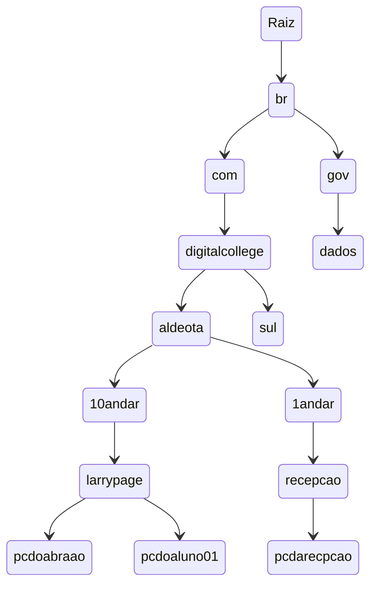
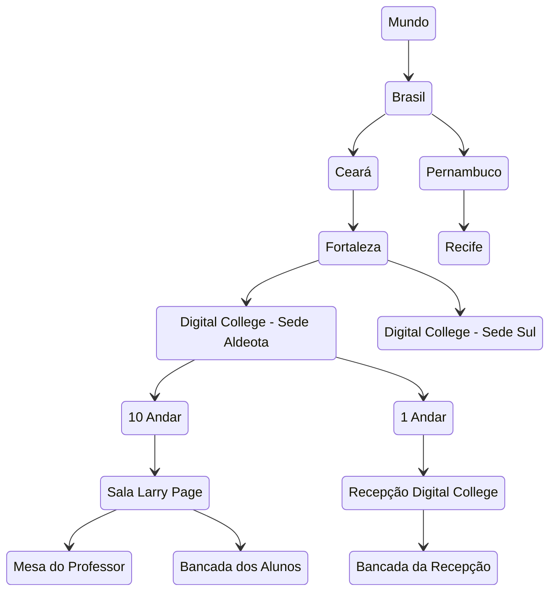
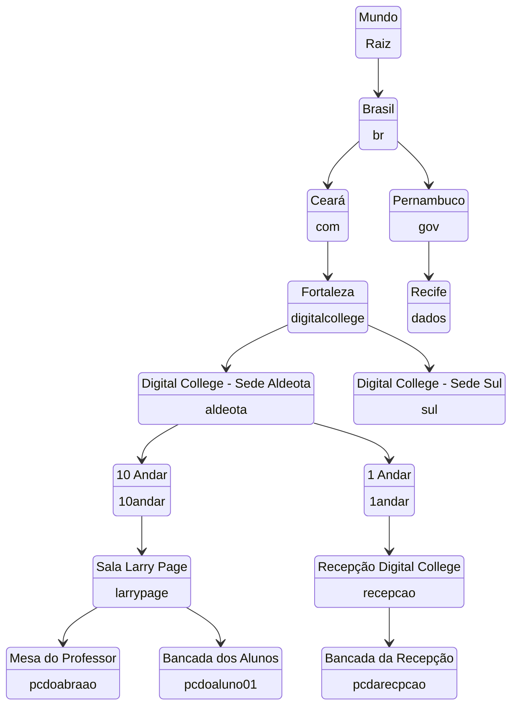

# Diagrama

## Site da Internet
Exemplo de endereço completo de uma maquina na rede
pcdoabraao.larrypage.10andar.aldeota.digitalcollege.com.br

## Analogia com Localização no Mundo Real

## Mesclado

