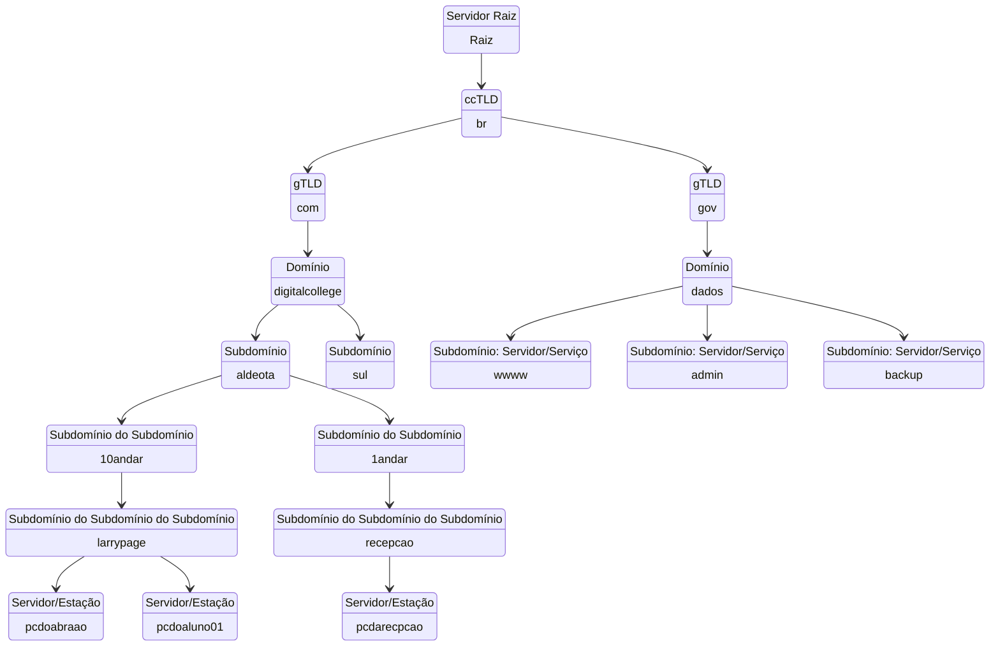

# O que é DNS?

## Introdução ao DNS

Quase tudo na Internet começa com uma solicitação DNS.DNS é o diretório da Internet. Clique em um link, abra um aplicativo, envie um e-mail, e a primeira coisa que o dispositivo faz é perguntar ao diretório: Onde encontro isso?  
Um servidor DNS é como uma enorme lista telefônica ou um dicionário, que guarda o nome dos sites e informa para os computadores os números IP pertencentes aqueles nomes.
Por exemplo, quando você digita <http://www.digitalcollege.com.br> no seu navegador, o DNS é responsável por encontrar o endereço IP correspondente a esse nome e direcionar a sua conexão para o servidor certo. Assim, você não precisa memorizar números complicados para acessar os sites que deseja.

---

## Hierarquia de DNS

- No topo da hierarquia estão os 13 servidores raiz. Um servidor-raiz (root name server) é um servidor de nome para a zona raiz do DNS.
- Cada domínio é formado por nomes separados por pontos. O nome mais à direita é chamado de domínio de topo.
- O domínio de topo de código de país (ccTLD), é o domínio de topo na Internet geralmente usado ou reservado para um país ou um território dependente. Ex.: .br .ar .pt .tv (Tuvalu)
- Raiz: "."
- Domínios de primeiro nível (TLDs): **br.**
  - ccTLD (TLD codigo de país): .br .ar .pt .tv
  - gTLD (TLD genéricos): .com .net .org / .mil .edu .gov
- Subdomínios do ccTLD: **com.br**
  - .com .net .org .mil .edu .gov
- Domínios de segundo nível: **digitalcollege.com.br**

---

## Diagrama Funcionamento do DNS

- Recursor de DNS — o bibliotecário solicitado a procurar um livro.

- Servidor raiz — o servidor raiz é a primeira etapa da tradução (resolução). É o índice em uma biblioteca que aponta para diferentes estantes de livros.

- Nameserver TLD - Uma estante de livros específica em uma biblioteca.

- Servidor de DNS autoritativo — Um dicionário em uma estante de livros, no qual um nome específico pode ser traduzido em sua definição (IP).

O nameserver autoritativo é a última parada na consulta de um servidor de DNS. Se tiver acesso ao registro solicitado, o nameserver autoritativo retornará o endereço IP do hostname solicitado de volta ao recursor de DNS (o bibliotecário) que fez a solicitação inicial.

| FUNCIONAMENTO | HIERARQUIA
|:----:|:----:|
| ![FUNCIONAMENTO] | ![hierarquia] |

---

## DNS para segurança de navegação

### Filtragem de conteúdo: Bloqueio de sites indesejados

- Bloqueio de malware e conteúdo adulto juntos, altere o DNS do seu roteador para:
  - **1.1.1.3**
  - **1.0.0.3**
- Apenas bloqueio de malware: altere o DNS do seu roteador para:
  - **1.1.1.2**
  - **1.0.0.2**

O 1.1.1.1 é o resolvedor de DNS da Cloudflare, ficou popular rapidamente.  Exatamente dois anos depois, a companhia decidiu lançar mais serviços do tipo, só que focados em segurança e no bloqueio de conteúdo adulto: os servidores de DNS 1.1.1.2 e 1.1.1.3, ambos gratuitos.

---

## Conclusão

- O DNS é essencial para a navegação na Internet
- Permite tradução de nomes de domínio em endereços IP
- DNS pode ser usado para melhorar a segurança da navegação
- Filtragem de conteúdo, bloqueio de sites adultos e detecção de sites maliciosos são algumas das aplicações do DNS na segurança

[HIERARQUIA]:  https://github.com/rodolfobertini/rodolfobertini/assets/132242813/b34003f5-473d-4438-a9d5-7132460728f3

[FUNCIONAMENTO]: https://github.com/rodolfobertini/rodolfobertini/assets/132242813/b5c2f05d-834e-4f2b-a1e7-d468871be3d4

---

### Extra: Explicação sobre subdomínios

