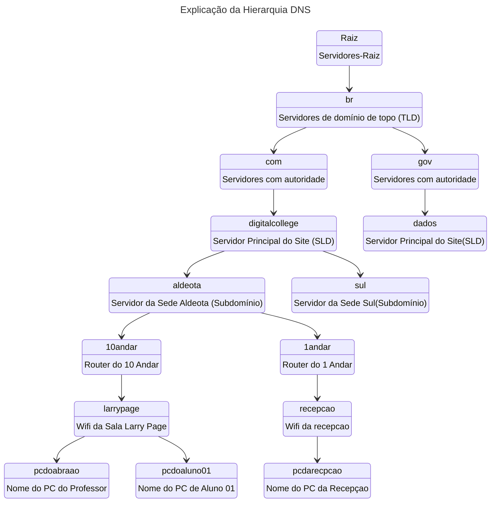
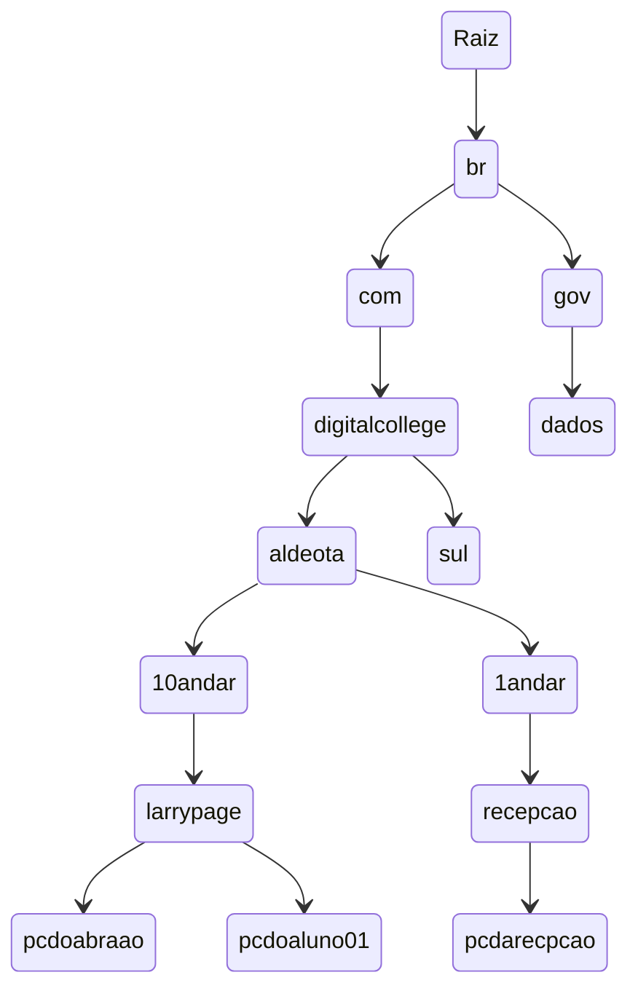
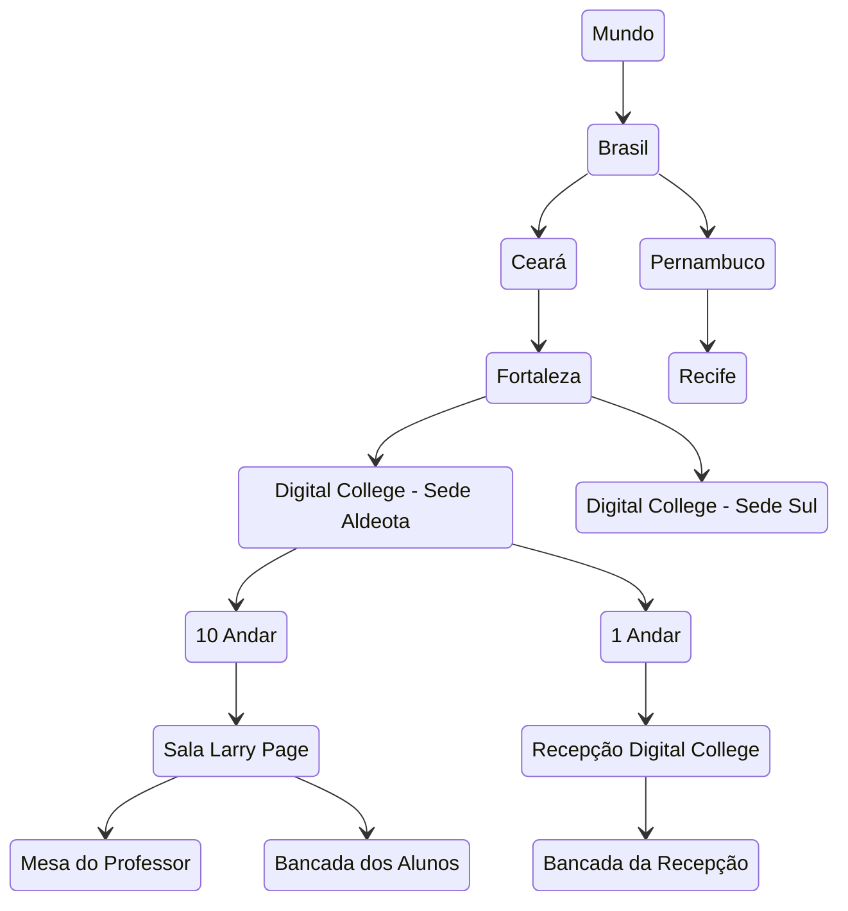
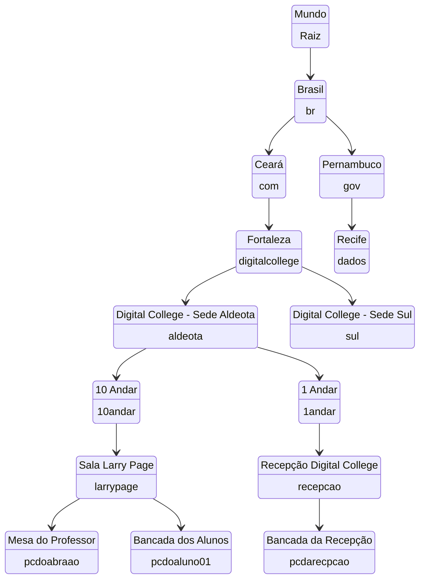

<!-- Conteúdo do PDF da Digital College -->
# **DNS** ***(Domain name system)***

## Diagrama

### Explicação da Hierarquia DNS

### Site da Internet

Exemplo de endereço completo de uma maquina na rede
pcdoabraao.larrypage.10andar.aldeota.digitalcollege.com.br

### Analogia com Localização no Mundo Real

### Mesclado

